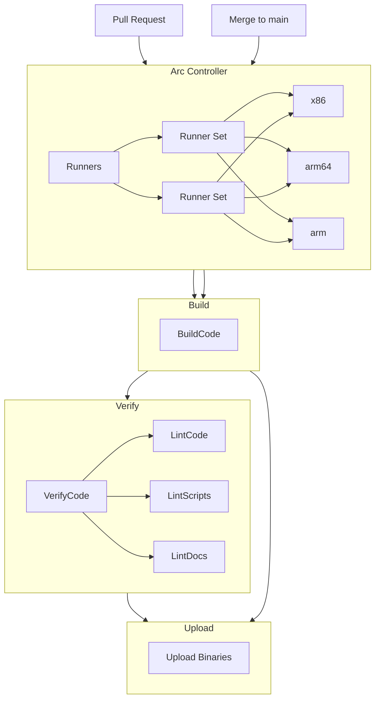

# Continuous Integration (CI)

The vAccel project uses a Kubernetes-native, multi-architecture CI
infrastructure designed for reliability, scalability, and reuse across all
repositories in the ecosystem. CI is built around GitHub Actions, self-hosted
runners, and reusable workflows.

## Architecture Overview

- **Runner Orchestration**: Self-hosted runners are managed using
  [GitHub Actions Runner Controller (ARC)](https://github.com/actions/actions-runner-controller)
  on a K3s cluster.
- **Provisioning**: VMs are dynamically spawned via
  [Incus](https://linuxcontainers.org/incus/) on `x86_64` and `arm64` bare-metal
  nodes.
- **Bootstrap**: Each VM joins the cluster on boot and registers as a member to
  the joint K3s control plane.

### Supported Runner Tags

| Tag          | Description                                   |
| ------------ | --------------------------------------------- |
| `base`       | Toolchains: GCC, Clang/LLVM, Rust, Go, Python |
| `torch`      | PyTorch stack with OpenCV, Torch runtime      |
| `tensorflow` | TensorFlow runtime and libraries              |
| `tvm`        | TVM runtime and compiler stack                |
| `jetson`     | Jetson AGX platform with JetPack & CUDA       |

## CI Directory Structure

Each repository in the vAccel ecosystem uses a standardized `.github/` layout:

### `.github/actions/`

Reusable GitHub Actions for CI tasks.  
Example: [`build`](https://github.com/nubificus/vaccel/blob/main/.github/actions/build/action.yml)

- Modular and script-driven
- Automatically handles multi-arch builds
- Plugin-agnostic logic (based on `meson`)

### `.github/workflows/`

Top-level workflows that coordinate testing, building, and artifact handling.

- [`pr-build-and-verify.yml`]

  Triggers on each pull request and performs:

  - Linting
  - Architecture-specific builds
  - Example (end-to-end tests) execution (via `run_examples.sh`)
  - Artifact staging

- [`verify-build.yml`]

  A reusable workflow invoked by other repos to validate builds with
  standardized steps.

[`pr-build-and-verify.yml`]:
  https://github.com/nubificus/vaccel/blob/main/.github/workflows/pr-build-and-verify.yml
[`verify-build.yml`]:
  https://github.com/nubificus/vaccel/blob/main/.github/workflows/verify-build.yml

## Testing Strategy

All repositories in the vAccel ecosystem include a `run_examples.sh` script,
which is used to:

- Set up required runtime environments
- Run only the relevant examples per context
- Validate outputs and detect regressions

These are invoked automatically by the workflows during CI runs, ensuring both
core framework and plugin-specific coverage.

## Artifact Publishing

On `main` branch merges and tagged releases:

- Binaries (`DEB`s, `TAR`s, `.so`, etc.) are compiled for supported
  architectures
- Files are uploaded to a secure, versioned S3-compatible object storage
- Downstream components reference artifacts using semantic versions

This approach enables:

- Binary-only integrations on resource-constrained platforms
- Secure and reproducible builds

## Example diagram

