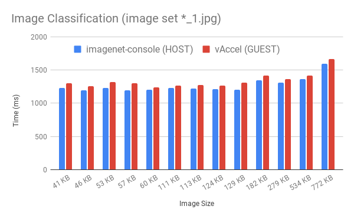

# Welcome to vAccel Documentation

This website contains documentation for vAccel, a framework that semantically
exposes hardware acceleration functionality to isolated workloads running on VM
sandboxes.

vAccel enables workloads to enjoy hardware acceleration while running on
environments that do not have direct (physical) access to acceleration devices.

The design goals of vAccel are:

1. **portability**: vAccel applications can be deployed in machines with
   different hardware accelerators without re-writing or re-compilation.
2. **security**: A vAccel application can be deployed, _as is_, in a VM to
   ensure isolation in multi-tenant environments. [QEMU](https://www.qemu.org),
   [Firecracker](https://firecracker-microvm.github.io/) and
   [Cloud Hypervisor](https://www.cloudhypervisor.org/) are currently supported
3. **compatibility**: vAccel supports the OCI container format through
   integration with the [Kata containers](https://katacontainers.io/) framework
   [downstream].
4. **low-overhead**: vAccel uses a very efficient transport layer for offloading
   "accelerate-able" functions from inside the VM to the host, incurring minimum
   overhead.
5. **scalability**: Integration with k8s allows the deployment of vAccel
   applications at scale.

## vAccel design

<figure>
  <!---->
  
  <figcaption>Figure 1. vAccel software stack</figcaption>
</figure>

The core component of vAccel is the runtime library. vAccel runtime library is
designed in a modular way: the core runtime exposes the vAccel API to user
applications and dispatches requests to one of many _backend plugins_, which
implement the glue code between the vAccel API operations on a particular
hardware accelerator.

The user application links against the core runtime library and the plugin
modules are loaded at runtime. This workflow decouples the application from the
hardware accelerator-specific parts of the stack, allowing for seamless
migration of the same binary to different platforms with different accelerator
capabilities, without the need to recompile user code.

The backend plugins conform to a simple _plugin API_. At the moment we have
support for:

1. [Jetson inference](https://github.com/dusty-nv/jetson-inference) framework,
   for acceleration of ML operation on Nvidia GPUs.
2. [Google Coral TPU](https://www.coral.ai/), for acceleration on Coral TPUs.
3. [OpenVINO inference](https://github.com/openvinotoolkit/openvino) framework,
   for image inference on OpenCL-compatible accelerators (Intel CPU/GPUs,
   MyriadX chips etc.).
4. [Tensorflow](https://github.com/tensorflow/tensorflow), with a limited number
   of operations and API calls supported.
5. [PyTorch](https://github.com/pytorch/pytorch), with a limited number of
   operations and API calls supported.
6. [Xilinx PYNQ](https://github.com/xilinx/PYNQ), with a limited number of
   example programs supported.

### Hardware acceleration in Virtual Machines

Hardware acceleration for virtualized guests is, still, a real challenge.
Typical solutions involve device pass-through or paravirtual drivers that expose
hardware semantics inside the guest. vAccel differentiates itself from these
approaches by exposing coarse-grain "accelerate-able" functions in the guest
over a generic transport layer.

The semantics of the transport layer are hidden from the programmer. A vAccel
application that runs on baremetal with an Nvidia GPU can run _as is_ inside a
VM using our appropriate _VirtIO_ backend plugin.

We have implemented the necessary parts for our VirtIO driver in our forks of
[QEMU](https://github.com/nubificus/qemu-vaccel/tree/master+vaccel) and
[Firecracker](https://github.com/cloudkernels/firecracker/tree/vaccel-0.23)
hypervisors.

Additionally, we have designed the above transport protocol over sockets,
allowing vAccel applications to use any backend, as long as there is a socket
interface installed between the two peers. Existing implementations include
VSOCK and TCP sockets. Any hypervisor supporting `virtio-vsock` can support
vAccel. See the
[relevant page](tutorials/running-a-vaccel-application-on-a-vm.md) for more
information.

## Performance

<figure>
  
  <figcaption>Figure 2. vAccel performance overhead of VM execution with virtio
    and jetson-inference compared to bare-metal on x86_64</figcaption>
</figure>

Figure 2 depicts a performance comparison of the image classification operation
of a vAccel application running inside a Firecracker VM using the
Jetson-inference plugin compared to the execution of the same operation using
the Jetson-inference framework natively, running directly on the host.

The performance overhead of our stack is less that 5% of the native execution
time across a range of image sizes.

<figure>
  
  <figcaption>Figure 3. vAccel performance overhead of VM execution, on various
    backend plugins compared to bare-metal on x86_64 and aarch64</figcaption>
</figure>
