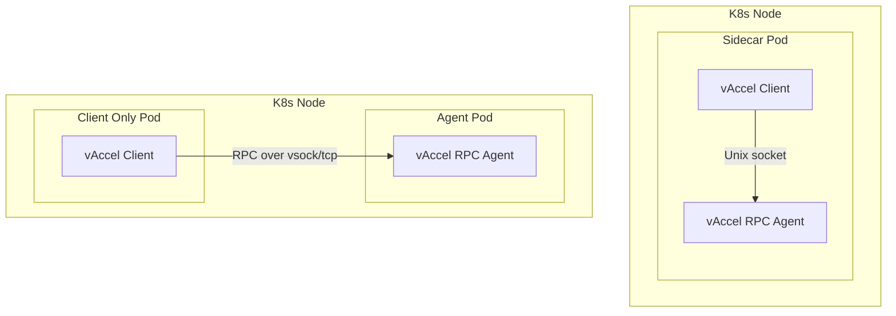

# Deploying vAccel applications using Kubernetes

This guide describes how to deploy the **vAccel framework** with Torch
acceleration using Kubernetes. It includes:

- Full explanation of the deployment architecture
- Sidecar-based co-location of client and agent
- Split deployment with remote agent access
- Dockerfiles for both client and agent
- Mermaid diagram for visual reference

## Architecture Overview

The deployment includes:

- A **vAccel Agent** (running `vaccel-rpc-agent`) exposing a Unix socket or TCP
  endpoint.
- A **vAccel Client** compiled with the RPC plugin and `libtorch`, which
  connects to the agent.
- A sidecar option to colocate both agent and client in one pod for
  latency-sensitive workloads.
- A split deployment option where the agent runs as a standalone DaemonSet.

## Deployment Graph



## Dockerfiles

### Agent Dockerfile

```dockerfile
FROM nvidia/cuda:11.8.0-cudnn8-devel-ubuntu22.04
USER root

# Python, pip, numpy
RUN apt-get update &&   apt-get install -y --no-install-recommends   python3-dev python3-pip python3-setuptools python3-wheel   python3-yaml python3-typing-extensions python3-numpy &&   apt-get clean && rm -rf /var/lib/apt/lists/*

# Dependencies + build tools
RUN apt-get update && apt-get install -y --no-install-recommends   unzip libopenblas-dev libjpeg-dev libpng-dev libtiff-dev   libavcodec-dev libavformat-dev libswscale-dev libv4l-dev   libxvidcore-dev libx264-dev libatlas-base-dev gfortran libffi-dev   wget cmake gcc g++ make libssl-dev git build-essential   pkg-config libcurl4-openssl-dev rsync &&   apt-get clean && rm -rf /var/lib/apt/lists/*

# Install vAccel core
RUN wget https://s3.nbfc.io/nbfc-assets/github/vaccel/rev/main/x86_64/release/vaccel_latest_amd64.deb &&     dpkg -i vaccel_latest_amd64.deb && rm vaccel_latest_amd64.deb && ldconfig

# Install libtorch
ARG PYTORCH_CUDA="cpu"
ENV PYTORCH_CUDA=${PYTORCH_CUDA}
RUN if [ "${PYTORCH_CUDA}" = "cpu" ]; then     wget https://download.pytorch.org/libtorch/cpu/libtorch-cxx11-abi-shared-with-deps-2.5.1%2Bcpu.zip &&     unzip libtorch-cxx11-abi-shared-with-deps-2.5.1+cpu.zip &&     rsync -a libtorch/ /usr/local/ && rm -rf libtorch*;   else     wget https://download.pytorch.org/libtorch/cu118/libtorch-cxx11-abi-shared-with-deps-2.5.1%2Bcu118.zip &&     unzip libtorch-cxx11-abi-shared-with-deps-2.5.1+cu118.zip &&     rsync -a libtorch/ /usr/local/ && rm -rf libtorch*;   fi

# Install vaccel-agent and plugin
RUN wget --no-check-certificate https://s3.nbfc.io/nbfc-assets/github/vaccel/rust/rev/main/x86_64/release/vaccel-rpc-agent_latest_amd64.deb &&     dpkg -i vaccel-rpc-agent_latest_amd64.deb && rm vaccel-rpc-agent_latest_amd64.deb

RUN wget --no-check-certificate https://s3.nbfc.io/nbfc-assets/github/vaccel/plugins/torch/rev/main/x86_64/release/vaccel-torch-latest-bin.tar.gz &&     tar -zxvf vaccel-torch-latest-bin.tar.gz --strip-components=1 -C / && rm vaccel-torch-latest-bin.tar.gz

RUN pip install ninja meson
ARG GITHUB_PAT
ENV GITHUB_TOKEN=${GITHUB_PAT}
RUN git clone https://${GITHUB_PAT}@github.com/nubificus/vaccel-plugin-torch &&     cd vaccel-plugin-torch && meson setup build && meson compile -C build && meson install -C build

ENV VACCEL_BACKENDS=/usr/local/lib/x86_64-linux-gnu/libvaccel-torch.so
ENTRYPOINT ["/usr/bin/vaccel-rpc-agent", "-a", "unix:///var/run/vaccel/vaccel.sock"]
```

### Client Dockerfile

```dockerfile
FROM ubuntu:latest
USER root

# Python, pip, numpy
RUN apt-get update &&   apt-get install -y --no-install-recommends   python3-dev python3-pip python3-setuptools python3-wheel   python3-yaml python3-typing-extensions python3-numpy &&   apt-get clean && rm -rf /var/lib/apt/lists/*

# Build + runtime dependencies
RUN apt-get update && apt-get install -y --no-install-recommends   unzip libopenblas-dev libjpeg-dev libpng-dev libtiff-dev   libavcodec-dev libavformat-dev libswscale-dev libv4l-dev   libxvidcore-dev libx264-dev libatlas-base-dev gfortran libffi-dev   wget cmake gcc g++ make libssl-dev &&   apt-get clean && rm -rf /var/lib/apt/lists/*

# Install vAccel core
RUN wget https://s3.nbfc.io/nbfc-assets/github/vaccel/rev/main/x86_64/release/vaccel_latest_amd64.deb &&     dpkg -i vaccel_latest_amd64.deb && rm vaccel_latest_amd64.deb && ldconfig

# Install libtorch
ARG PYTORCH_CUDA="cpu"
ENV PYTORCH_CUDA=${PYTORCH_CUDA}
RUN if [ "${PYTORCH_CUDA}" = "cpu" ]; then     wget https://download.pytorch.org/libtorch/cpu/libtorch-cxx11-abi-shared-with-deps-2.5.1%2Bcpu.zip &&     unzip libtorch-cxx11-abi-shared-with-deps-2.5.1+cpu.zip &&     mv libtorch /opt/pytorch && rm -rf libtorch*;   else     wget https://download.pytorch.org/libtorch/cu118/libtorch-cxx11-abi-shared-with-deps-2.5.1%2Bcu118.zip &&     unzip libtorch-cxx11-abi-shared-with-deps-2.5.1+cu118.zip &&     mv libtorch /opt/pytorch && rm -rf libtorch*;   fi

# Install RPC plugin
RUN wget --no-check-certificate https://s3.nbfc.io/nbfc-assets/github/vaccel/plugins/rpc/rev/main/x86_64/release/vaccel-rpc_latest_amd64.deb &&     dpkg -i vaccel-rpc_latest_amd64.deb && rm vaccel-rpc_latest_amd64.deb

# Build example application
COPY . /app
WORKDIR /app
RUN mkdir build && cd build && cmake ../ -DCMAKE_PREFIX_PATH=/opt/pytorch && make

ENV VACCEL_BACKENDS=libvaccel-rpc.so
```

## Sidecar Deployment (Single Pod)

```yaml
apiVersion: v1
kind: Pod
metadata:
    name: vaccel-sidecar-pod
spec:
    containers:
        - name: vaccel-agent
          image: vaccel/agent:latest
          volumeMounts:
              - name: vaccel-sock
                mountPath: /var/run/vaccel

        - name: vaccel-client
          image: vaccel/client:latest
          volumeMounts:
              - name: vaccel-sock
                mountPath: /var/run/vaccel

    volumes:
        - name: vaccel-sock
          emptyDir: {}
```

## Split Deployment

### Agent DaemonSet

```yaml
apiVersion: apps/v1
kind: DaemonSet
metadata:
    name: vaccel-agent
spec:
    selector:
        matchLabels:
            app: vaccel-agent
    template:
        metadata:
            labels:
                app: vaccel-agent
        spec:
            containers:
                - name: vaccel-agent
                  image: vaccel/agent:latest
                  ports:
                      - containerPort: 8888
                        name: rpc
```

### Client Pod

```yaml
apiVersion: v1
kind: Pod
metadata:
    name: vaccel-client
spec:
    containers:
        - name: vaccel-client
          image: vaccel/client:latest
          env:
              - name: VACCEL_RPC_ADDR
                value: "tcp://vaccel-agent-service:8888"
```

---

## Next Steps

- Customize your Torch model or plugin inside the client image
- Test workloads in the sidecar first for simplified debugging
- Scale via Deployment/Job or integrate with KNative
